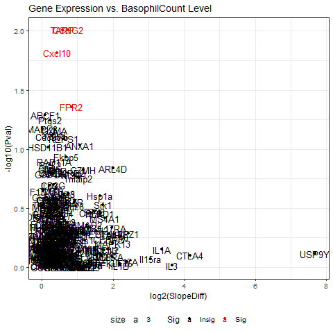

# <p align = "center"> Analyze-BASOPHILS-EOSINOPHILS: PART 1
   <p align = "center"> Stephane Djoumessi
   
 ## OVERVIEW

 <p style="text-indent"> (BTEC330-Analyze-Basophils-Eosinophils.R) will allow you to load a comma-delimited .csv with various datapoints, perform single regressions of Body Mass Index (BMI) vs. Basophils and Body Mass Index (BMI) vs. Eosinophils from the Complete Blood Count with Differential (CBC-D) results, and produce 2-D scatterplots, and boxplots for the results.
 
<p style="text-indent: 160px"> Data (RobinsonEtAl_Sup1.csv) was downloaded from: 
Robinson, JM. et al. 2019. Complete blood count with differential: An effective diagnostic for IBS subtype in the context of BMI? BioRxiv. doi: https://doi.org/10.1101/608208. 
      Normal ranges were obtained from: https://idph.iowa.gov/Portals/1/Files/IMMTB/Complete%20Blood%20Count.pdf

  * BASOPHILS: Definition & range
  
    Basophils appear in many specific kinds of inflammatory reactions, particularly those that cause allergic symptoms. Basophils contain anticoagulant heparin, which prevents blood from clotting too quickly. its normal range is [0.002-0.02 μg/dL.]

*   EOSINOPHILS: Definition & range
  
     Eosinophils are a type of disease-fighting white blood cell. Their presence often indicates a parasitic infection, an allergic reaction, or cancer. You can have high levels of eosinophils in your blood (blood eosinophilia) or in tissues at the site of an infection or inflammation (tissue eosinophilia). Its normal range is [0.004-0.04 μg/dL.]

   ##
### RESULTS OF SINGLE REGRESSION, BMI x BASOPHILS 
```
> single.regression <- lm(BMI ~ Basophils, data=IBS1)
> print(single.regression)

Call:
lm(formula = BMI ~ Basophils, data = IBS1)

Coefficients:
(Intercept)    Basophils  
      27.22       -15.31  

```
```
ggplot(IBS1, aes(x=BMI, y=Basophils)) +
  geom_point() +    
  geom_smooth(method=lm) 
  ```


##
### RESULTS OF BASOPHILS ONE WAY ANOVA: DATA AND BOXPLOT
```
> Basophils.aov <- aov(Basophils ~ IBS.subtype, data=IBS1)
> summary(Basophils.aov)
> sink('data_output/Basophils.txt', append = TRUE)
> print(Basophils.aov)
> sink()
```
```
>               Df  Sum Sq   Mean Sq F value Pr(>F)
> IBS.subtype   1 0.00007 6.993e-05   0.325   0.57
> Residuals     108 0.02322 2.150e-04  
```

##
### RESULTS OF SINGLE REGRESSION, BMI x EOSINOPHILS
```
> single.regression <- lm(BMI ~ Eosinophils, data=IBS1)
> print(single.regression)

Call:
lm(formula = BMI ~ Eosinophils, data = IBS1)

Coefficients:
(Intercept)  Eosinophils  
     26.362        3.091  

```

##

### RESULTS OF EOSINOPHILS ONE WAY ANOVA: DATA AND BOXPLOT
```
> Eosinophils.aov <- aov(Eosinophils ~ IBS.subtype, data=IBS1)
> summary(Eosinophils.aov)
> sink('data_output/Eosinophils.txt', append = TRUE)
> print(Eosinophils.aov)
> sink()
```
```
>               Df Sum Sq  Mean Sq F value Pr(>F)
> IBS.subtype   1  0.000 0.000006       0  0.982
> Residuals     108  1.343 0.012431
```


# <p align = "center"> Analyze-BASOPHILS-EOSINOPHILS: PART 2 
   
#  <p align = "center"> Data Frames and VolcanoPlots (Additional Lines of Codes
 
   <p style="text-indent"> (BTEC395-Basophils-Eosinophils-finalproject.R) will allow you to load a comma-delimited .csv with various datapoints, perform single regressions and anova of each gene expressed in the .csv file vs. Basophils or vs. Eosinophils.
   
   In addition, (BTEC395-Basophil-Eosinophil-finalproject.R) will  allow to perform a recursive analysis for regression which creates a date frame list to store all the genes necessary for the analysis. Transformations such as log2 FC and -log10 will be combined and exported to create a volcanoplot which computes the signfiance of each gene and relevance to the analysis being perfomred.
   
   <p style="text-indent: 160px"> The lines of codes used in this analysis were downloaded from:   
https://stackoverflow.com/questions/42464767/how-to-run-lm-regression-for-every-column-in-r.
https://stackoverflow.com/questions/44170937/performing-lm-and-segmented-on-multiple-columns-in-r.
http://www.learnbymarketing.com/tutorials/explaining-the-lm-summary-in-r/.
https://tutorials.iq.harvard.edu/R/Rstatistics/Rstatistics.html.


### Recursive analysis for regression  - RNA Expression ##
## Access only the columns with RNA Expression
```
> names(IBS1)[37:286]
```
## Make a data frame of list type
```
> storage <- list()
```

## linear regression for each expressed gene vs parameter (Basophil/Eosinophil)
```
for(i in names(IBS1)[37:286]){
 > storage[[i]]  <- lm(get(i) ~ Basophils/Eosinophil..x10.9.cells.L., IBS1)
}
```
## Make a list of anova(lm()) results for parameter (Basophil/Eosinophil)
```
> storage3 <- list()

for(i in names(IBS)[28:277]){
> storage3[[i]]  <- anova(lm(get(i) ~ BasophilCount/EosinophilCount, IBS))
}
 ```

## Result of the BasophilCount volcanoplot into fig_output data folder
 ```
png("../fig_output/BasophilCountplot.png")
BasophilCountplot <- ggplot(VolcanoPlotData, aes(x = `log2(SlopeDiff)`, y = `-log10(Pval)`, label=rownames(VolcanoPlotData), color=Sig)) +
  geom_point(aes(color = Sig)) +
  scale_color_manual(values = c("black", "red")) +
  theme_bw(base_size = 12) + theme(legend.position = "bottom") +
  geom_text(aes(x = `log2(SlopeDiff)`,y = `-log10(Pval)`, fontface = 1, size=3,  label=row.names(VolcanoPlotData)))

print(BasophilCountplot + ggtitle("Gene Expression vs. BasophilCount Level"))
dev.off()
 ```
 
 
 ## Gene Significance for BasophilCount
 
  | Gene | Name|
  |------|-----|
  |Cxcl10| C-X-C Motif Chemokine 10|
  | FPR2 | N-formyl peptide receptor 2|
  |CCNG2 | Cyclin Glycin 2|
  |TARP2 |TCR Alternate Reading Frame Portein 2|

## Result of the EosinophilCount volcanoplot into fig_output data folder
 ```
png("../fig_output/EosinophilCountplot.png")
EosinophilCountplot <- ggplot(VolcanoPlotData2, aes(x = `log2(SlopeDiff)`, y = `-log10(Pval)`, label=rownames(VolcanoPlotData2), color=Sig)) +
  geom_point(aes(color = Sig)) +
  scale_color_manual(values = c("black", "red")) +
  theme_bw(base_size = 12) + theme(legend.position = "bottom") +
  geom_text(aes(x = `log2(SlopeDiff)`,y = `-log10(Pval)`, fontface = 1, size=3,  label=row.names(VolcanoPlotData2)))

print(EosinophilCountplot + ggtitle("Gene Expression vs. EosinophilCount Level"))
dev.off()
 ```


## Gene Significance for EosinophilCount

 | Gene | Name|
 |------|-----|
 | CCR3 | C-C-Chemokine Receptor 3|
 | CCR6 | C-C-Chemokine Receptor 6|
 |FPR2  |N-formyl peptide receptor 2
 |TARP2 |TCR Alternate Reading Frame Portein 2|


