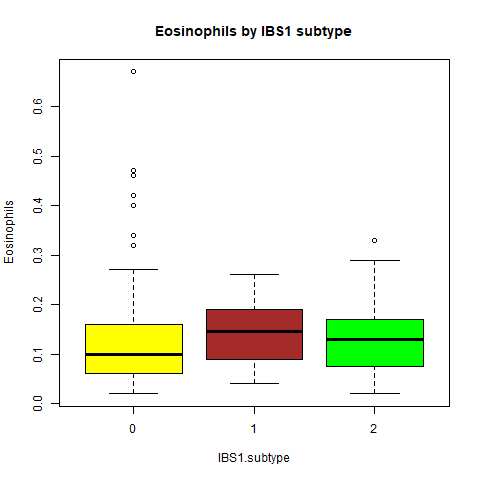

# Analyze-BASOPHILS-EOSINOPHILS
Single and multiple regressions, and scatterplots for clinical bloodwork and gene expression data.
## AnalyzeBasophils-Eosiniphils

### Single regressions, and scatterplots for clinical bloodwork and gene expression data.
([AnalyzeBloodwork.R](../master/AnalyzeBloodwork.R)) will allow you to load a comma-delimited .csv with various datapoints, perform single regression of Body Mass Index (BMI) vs. Basophils (CBC-D) results, and produce 2-D scatterplots for the results. 

Data (RobinsonEtAl_Sup1.csv) was downloaded from: 

Robinson, JM. et al. 2019. Complete blood count with differential: An effective diagnostic for IBS subtype in the context of BMI? BioRxiv. doi: https://doi.org/10.1101/608208.

##
### Results of single regression, BMI x Basophils
```
> single.regression <- lm(BMI ~ Basophils, data=IBS1)
> print(single.regression)

Call:
lm(formula = BMI ~ Basophils, data = IBS1)

Coefficients:
(Intercept)    Basophils  
      27.22       -15.31  

```
```
ggplot(IBS1, aes(x=BMI, y=Basophils)) +
  geom_point() +    
  geom_smooth(method=lm) 
```

##
### Results of single regression, BMI x Eosinophils
```
> single.regression <- lm(BMI ~ Eosinophils, data=IBS1)
> print(single.regression)

Call:
lm(formula = BMI ~ Eosinophils, data = IBS1)

Coefficients:
(Intercept)  Eosinophils  
     26.362        3.091  

```


## Basophils boxplot

$stats
     [,1] [,2]  [,3]
[1,] 0.01 0.01 0.000
[2,] 0.02 0.02 0.015
[3,] 0.03 0.02 0.030
[4,] 0.03 0.03 0.030
[5,] 0.04 0.04 0.050

$n
[1] 77 14 19

$conf
           [,1]       [,2]       [,3]
[1,] 0.02819942 0.01577727 0.02456285
[2,] 0.03180058 0.02422273 0.03543715

$out
 [1] 0.10 0.05 0.05 0.06 0.05 0.00 0.06 0.06 0.05 0.05 0.07

$group
 [1] 1 1 1 1 1 1 1 1 1 1 3

$names
[1] "0" "1" "2"

## Eosinophils Boxplot

## Basophils scatterplot

## Eosinophils scatterplot

