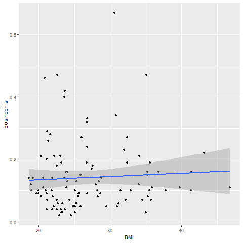

# <p align = "center"> Analyze-BASOPHILS-EOSINOPHILS
   <p align = "center"> Stephane Djoumessi
   
## OVERVIEW

 (Analyze-Basophils-Eosinophils.R) will allow you to load a comma-delimited .csv with various datapoints, perform single regressions of Body Mass Index (BMI) vs. Basophils and Body Mass Index (BMI) vs. Eosinophils from the Complete Blood Count with Differential (CBC-D) results, and produce 2-D scatterplots, and boxplots for the results.
 
 Data (RobinsonEtAl_Sup1.csv) was downloaded from: 
Robinson, JM. et al. 2019. Complete blood count with differential: An effective diagnostic for IBS subtype in the context of BMI? BioRxiv. doi: https://doi.org/10.1101/608208. 
      Normal ranges were obtained from: https://idph.iowa.gov/Portals/1/Files/IMMTB/Complete%20Blood%20Count.pdf

  *  BASOPHILS: Definition & range
  
  Basophils appear in many specific kinds of inflammatory reactions, particularly those that cause allergic symptoms. Basophils contain anticoagulant heparin, which prevents blood from clotting too quickly. its normal range is [0.002-0.02 μg/dL.]

* IEOSINOPHILS: Definition & range
  
  Eosinophils are a type of disease-fighting white blood cell. Their presence often indicates a parasitic infection, an allergic reaction, or cancer. You can have high levels of eosinophils in your blood (blood eosinophilia) or in tissues at the site of an infection or inflammation (tissue eosinophilia). Its normal range is [0.004-0.04 μg/dL.]

   ##
### Results of single regression, BMI x Basophils
```
> single.regression <- lm(BMI ~ Basophils, data=IBS1)
> print(single.regression)

Call:
lm(formula = BMI ~ Basophils, data = IBS1)

Coefficients:
(Intercept)    Basophils  
      27.22       -15.31  

```
```
ggplot(IBS1, aes(x=BMI, y=Basophils)) +
  geom_point() +    
  geom_smooth(method=lm) 
  ```


##
### Results of single regression, BMI x Eosinophils
```
> single.regression <- lm(BMI ~ Eosinophils, data=IBS1)
> print(single.regression)

Call:
lm(formula = BMI ~ Eosinophils, data = IBS1)

Coefficients:
(Intercept)  Eosinophils  
     26.362        3.091  

```



## Results of Basophils one Way ANOVA: Data and Boxplot
```
> Basophils.aov <- aov(Basophils ~ IBS.subtype, data=IBS1)
> summary(Basophils.aov)
> sink('data_output/Basophils.txt', append = TRUE)
> print(Basophils.aov)
> sink()
```
```
>               Df  Sum Sq   Mean Sq F value Pr(>F)
> IBS.subtype   1 0.00007 6.993e-05   0.325   0.57
> Residuals     108 0.02322 2.150e-04  
```


## Results of Eosinophils one way ANOVA: data and Boxplot
```
> Eosinophils.aov <- aov(Eosinophils ~ IBS.subtype, data=IBS1)
> summary(Eosinophils.aov)
> sink('data_output/Eosinophils.txt', append = TRUE)
> print(Eosinophils.aov)
> sink()
```
```
>               Df Sum Sq  Mean Sq F value Pr(>F)
> IBS.subtype   1  0.000 0.000006       0  0.982
> Residuals     108  1.343 0.012431
```


